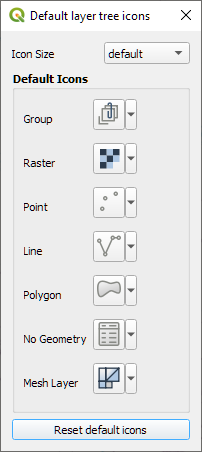
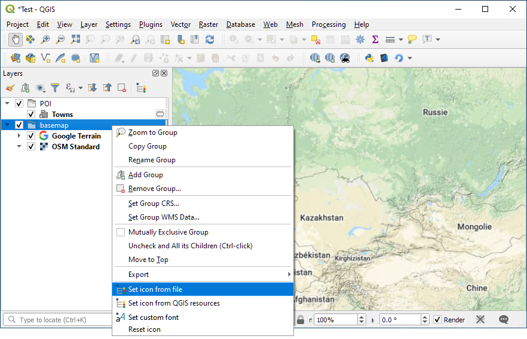

Layer Tree Icons (QGIS plugin)
===


This plugin adds some actions in the QGIS layer tree context menu to set a custom icon and/or font on any node.
It includes a ressource browser to use QGIS icons. Icons can also be set for a given node type (i.e. group, or polygon layer).

Category Icon
--
It is possible to set new icons for node categories, from the plugin menu, or from a new button, added in the Layer Panel toolbar. It is also possible to change the default icon size and layer and group fonts in this dialog.



Node Icon
--
Custom icons can be set by right-clicking on a node in the Layer Panel.



 - **Set icon from file**: Browse the computer to set the node icon from an image file
 - **Set icon from QGIS resources**: Open a Resource Browser to use one of the icons embedded in QGIS
 - **Set custom font**: Open a QFontDialog to set a custom font for tthe currently selected nodes
 - **Reset icon (& font)** (visible if a custom icon or font is set): Revert to the default icon, or, if defined, to the custom icon for the node's category. Also reset the custom font if an

Resource browser
--


The resource browser allow to search through the embedded .qrc files to look for images to use as icon.

PyQGIS Cookbook
--

 - Set custom icon for a specific node:

```python
iface.layerTreeView().currentNode().setCustomProperty(
    "plugins/customTreeIcon/icon",
    "path/to/icon.png"
)
```

 - Set font a specific node:

```python
f = QFont("Consolas", 12)
iface.layerTreeView().currentNode().setCustomProperty(
    "plugins/customTreeIcon/font",
    f.toString()
)
```

 - Set custom icon for an icon type:
```python
# Group
QSettings().setValue("plugins/layertreeicons/defaulticons/group", "path/to/icon.png")
# Raster
QSettings().setValue("plugins/layertreeicons/defaulticons/raster", "path/to/icon.png")
# Point
QSettings().setValue("plugins/layertreeicons/defaulticons/point", "path/to/icon.png")
# Line
QSettings().setValue("plugins/layertreeicons/defaulticons/line", "path/to/icon.png")
# Polygon
QSettings().setValue("plugins/layertreeicons/defaulticons/polygon", "path/to/icon.png")
# No Geometry
QSettings().setValue("plugins/layertreeicons/defaulticons/nogeometry", "path/to/icon.png")
# Mesh
QSettings().setValue("plugins/layertreeicons/defaulticons/mesh", "path/to/icon.png")
```

Context Menu
--
The QGIS API provides an interface, `QgsLayerTreeViewMenuProvider` to create custom layer tree context menus. So to set up a custom menu, one would need to keep a reference to the default menuProvider, and to use it in the `createContextMenu` method:

```python
class MyCustomMenuProvider(QgsLayerTreeViewMenuProvider):

    def __init__(self, view):
        super().__init__()
        self.view = view
        self.original_menu_provider = self.view.menuProvider()

    def createContextMenu(self):
        menu = self.original_menu_provider.createContextMenu()

        menu.addSeparator()
        menu.addAction("MyCustomAction")
        return menu

provider = MyCustomMenuProvider(iface.layerTreeView())
iface.layerTreeView().setMenuProvider(provider)

```

The official pyQGIS documentation mentions this method in its [cheat_sheet section](https://docs.qgis.org/3.10/en/docs/pyqgis_developer_cookbook/cheat_sheet.html#table-of-contents
):

```python
ltv = iface.layerTreeView()
mp = ltv.menuProvider()
ltv.setMenuProvider(None)
# Restore
ltv.setMenuProvider(mp)
```

However, due to an implementation detail in QGIS, both these code snippets can lead to a crashes. Setting the menuProvider on the `QgsLayerTreeView` delete the underlying c++ object of the old c++ menuProvider (see [QgsLayerTreeView source code](https://www.qgis.org/api/qgslayertreeview_8cpp_source.html#l00122)).


```python
ltv = iface.layerTreeView()
mp = ltv.menuProvider()

# At this point mp underlying c++ object is destroyed
ltv.setMenuProvider(None)

# Ok, the Python wrapper still exists (and possibily because createContextMenu is a SIP_FACTORY method)
mp.createContextMenu()

# Still no problem at this point
ltv.setMenuProvider(mp)

# CRASH: attempt to destroy mp's underlying c++ item, but is is already destroyed
ltv.setMenuProvider(None)

```

While this might not seem a big deal, this effectively prevent from reloading (or from disabling then reenabling) a plugin that relies on this mechanism. Besides, the current mechanism is not well suited for plugins that just adds some actions to the exisiting context menu.

Instead of a single menuProvider, it would be best to have a list of menuProviders, that could be added and removed as needed by the plugins.

---
Hackish resolution
--
The [`LayerTreeContextMenuManager`](https://github.com/YoannQDQ/qgis-layer-tree-icons/blob/master/layertreecontextmenumanager.py) class used by this plugin aims to do just that, albeit in a hackish way.

It monkey patches the default menuProvider (if not already patched by another plugin) and
provides an `addProvider` method. Providers added via this method will be removed
when the `LayerTreeContextMenuManager` is deleted

Example usage (adds a useless "Print Clicked" action to the context menu):

```python
def foo(menu):
    menu.addAction("Print clicked").triggered.connect(lambda: print("Clicked"))

contextMenuManager = LayerTreeContextMenuManager()
contextMenuManager.addProvider(foo)
```

The provider can be any python callable (function, method, class instance with a `__call__` method, etc.) that takes a `QMenu` and modifies it

Here's a minimalist python plugin that adds opacity controls in the context menu

**`layertreecontextmenumanager.py`**
```python
from PyQt5.QtCore import QObject, QEvent
from qgis.utils import iface

def createContextMenu(event):
    menu = iface.layerTreeView().menuProvider()._original()
    for provider in iface.layerTreeView().menuProvider().providers:
        try:
            provider(menu, event)
        except TypeError:
            provider(menu)
    return menu

class LayerTreeContextMenuManager(QObject):
    """ Installed as an event filter on the QGIS layer tree
    """

    def __init__(self, parent=None):
        super().__init__(parent)
        self.view = iface.layerTreeView()
        self.menuProvider = self.view.menuProvider()

        # List of custom providers intalled by this plugin
        self.providers = []

        # Patch the menuProvider
        self.patch()

        # Install itself as an eventFilter on the view
        self.view.viewport().installEventFilter(self)

    def patch(self):

        # Patch the default menuProvider
        # Keep a reference to the old one
        if not hasattr(self.menuProvider, "_original"):
            self.menuProvider._original = self.menuProvider.createContextMenu
        if not hasattr(self.menuProvider, "providers"):
            self.menuProvider.providers = []

        self.menuProvider.createContextMenu = createContextMenu

    def eventFilter(self, obj, event):
        """ Allow to call the patched createContextMenu (otherwise, the original c++
        version is called) """
        if event.type() == QEvent.ContextMenu:
            menu = self.menuProvider.createContextMenu(event)
            menu.exec(self.view.mapToGlobal(event.pos()))
            return True
        return False

    def addProvider(self, provider):
        if not callable(provider):
            return
        if provider in self.menuProvider.providers:
            return
        self.providers.append(provider)
        self.menuProvider.providers.append(provider)

    def removeProvider(self, provider):
        try:
            self.menuProvider.providers.remove(provider)
        except ValueError:
            pass

    def __del__(self):
        for provider in self.providers:
            self.removeProvider(provider)
        self.view.viewport().removeEventFilter(self)

```

**opacity_provider.py**
```python
from functools import partial

from PyQt5.QtWidgets import QAction

from qgis.utils import iface
from qgis.core import QgsLayerTree

class OpacityMenuProvider:
    def __init__(self):
        self.view = iface.layerTreeView()

    def __call__(self, menu):
        if QgsLayerTree.isLayer(self.view.currentNode()):
            menu.addSeparator()
            for opacity in [25, 50, 75, 100]:
                action = QAction(f"Set opacity {opacity}%", menu)
                menu.addAction(action)
                action.triggered.connect(partial(self.set_opacity, opacity/100))

    def set_opacity(self, value):
        layer = self.view.currentNode().layer()
        try:
            layer.setOpacity(value)
        except AttributeError:
            layer.renderer().setOpacity(value)
        layer.triggerRepaint()
```

**opacity_plugin.py**
```python

from .layertreecontextmenumanager import LayerTreeContextMenuManager
from .opacity_provider import OpacityMenuProvider

class OpacityPlugin:
    """QGIS Plugin Implementation."""

    def __init__(self, iface):
        """Constructor.
        :type iface: QgsInterface
        """
        # Save reference to the QGIS interface
        self.iface = iface


    def initGui(self):
        """Create the menu entries"""
        self.contextMenuManager = LayerTreeContextMenuManager()
        self.contextMenuManager.addProvider(OpacityMenuProvider())

    def unload(self):
        """ Nothing to do, custom menu action will be removed when self.contextMenuManager is destroyed """
        pass


```

Proper resolution
--
TODO: create a QGIS feature request


*Copyright © 2020 Yoann Quenach de Quivillic*

